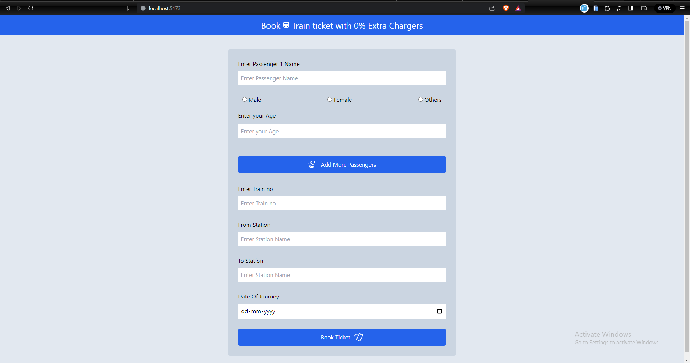

# Railway Ticket App

This challenge is part of free internship (Fullstack Engineer) offered by [CyberDude Networks Pvt. Ltd.](https://cyberdudenetworks.com) You can find all the source code and live links below.

> Task : create a form and send the form detail to a server in json datatype

#### Screen shots

<video width="320" height="240" controls>
  <source src="./public/form-data-server.mp4" type="video/mp4">
</video>

[live preview ](https://sharif-22.github.io/cyberdude-challenges/javascript%20dom/02-railway-tkt-app/dist/)

<!-- ### start the server

cd .\server\

<!-- start server using -->

<!-- json-server --watch data.json -->
