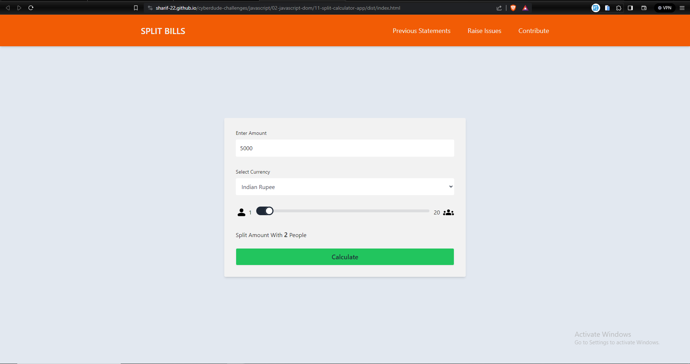

# Split Calculator

build a simple split calculator with expance tracker

## Table of Contents

- [Project Title](#project-title)
- [Description](#description)
- [Demo](#demo)
- [Internship](#internship)
- [Technologies Used](#technologies-used)
- [Features](#features)
- [Contributing](#contributing)
- [License](#license)

## Description

Build a Simple Split Calculator App using `HTML` `TailwindCss` `javascript` . in this split calculator we can save your transaction with various country currency and track your daily small expense with detailed **Title** **Descriptions**

## Demo

### [Live Preview ](https://sharif-22.github.io/cyberdude-challenges/javascript/02-javascript-dom/11-split-calculator-app/dist/index.html)



## Internship

This internship is provided by [CyberDude Networks Pvt. Ltd.](https://youtube.com/cyberdudenetworks) as part of the 6-Month Free Internship program, a skill development initiative organized to enhance participants' skills. Mentoring was provided by [Mr. Anbuselvan Rocky](https://instagram.com/anbuselvanrocky). For more information, [you can contact CyberDude Networks here](https://cyberdudenetworks.com).

## Technologies Used

<ol>
<li>HTML</li>
<li>Tailwind CSS</li>
<li>Javascript DOM</li>
<li>vite </li>
</ol>

## Features

- Track Group Expense
- Track Expence with your Country Currency

## Contributing

<h3>Fork the Repository:</h3>

```
git clone https://github.com/<Your UserName >/cyberdude-challenges.git
```

Navigate to the project

```
cd cyberdude-challenges\javascript\02-javascript-dom\11-split-calculator-app
```

Install the Dependencies

```
npm install
```

Run the Project

```
npm run dev
```

## License

[MIT](./LICENCE.md)
