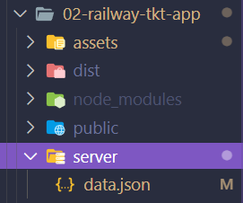

# Railway Ticket Booking App

This challenge is part of free internship (Fullstack Engineer) offered by [CyberDude Networks Pvt. Ltd.](https://cyberdudenetworks.com) You can find all the source code and live links below.

> Task : create a form and send the form detail to a server in json datatype

#### Screen shots

Click the below img to view the video

[](http://www.youtube.com/watch?v=Tnypi1nh0-s)

check out [live preview ](https://sharif-22.github.io/cyberdude-challenges/javascript%20dom/02-railway-tkt-app/dist/)

### core Logics

- get form data
- formate the data
- push the data to server

#### code snippets

```js
// getting form datas
const formData = new FormData(formEl);

// console.log(Object.fromEntries(formData)); // return all obj data in unstructure way
const formDataObj = Object.fromEntries(formData);
```

```js
// optimizing obj in structural way

const formDataObj = Object.fromEntries(formData);

const passengersObjsArr = [];
// loop to push individual passengers to arr

for (let index = 0; index <= 5; index++) {
  //checking the key has the value is not undefined it will be true if value is undefined it will be false
  if (
    formDataObj[`passenger${index}Age`] &&
    formDataObj[`passenger${index}Gender`] &&
    formDataObj[`passenger${index}Name`]
  ) {
    passengersObjsArr.push({
      passengerAge: formDataObj[`passenger${index}Age`],
      passengerGender: formDataObj[`passenger${index}Gender`],
      passengerName: formDataObj[`passenger${index}Name`],
    });
  }
}

// converting form data {} to journey data {} in proper structure
const journeyData = {
  trainNum: formDataObj["trainNum"],
  toStation: formDataObj["toStation"],
  fromStation: formDataObj["fromStation"],
  dateOfJourney: formDataObj["dateOfJourney"],
  passengersDetails: passengersObjsArr,
};
```

```js
//  sending data to server

// converting journeyDate -> JSON
const jsonData = JSON.stringify(journeyData);
console.log(jsonData);
// Send to Backend
const url = "http://localhost:3000/tickets";

const postMethod = async (json, url) => {
  await fetch(url, {
    method: "post",
    headers: {
      "Content-Type": "application/json",
    },
    body: json,
  });
};

postMethod(jsonData, url);
```

```js
// removing existing inputs
formEl.reset();
resetStyles();

// removing empty extra passengers input elements
if (passengersListEl.children.length > 1) {
  for (let i = passengersListEl.children.length; i > 1; i--) {
    // console.log(i);
    passengersListEl.children[i - 1].remove();
  }
}
```

### start the json server in your meachine

[install json server](https://www.npmjs.com/package/json-server)



i changed my directory from `02-railway-tkt-app` to `02-railway-tkt-app\server`

cd .\server\

**start server using**

`json-server --watch filename.json`

json-server --watch data.json
